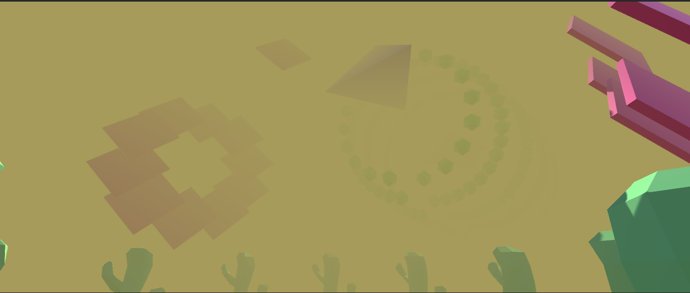
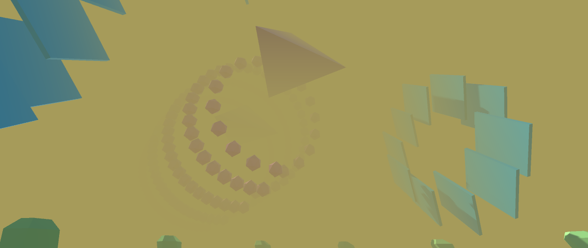
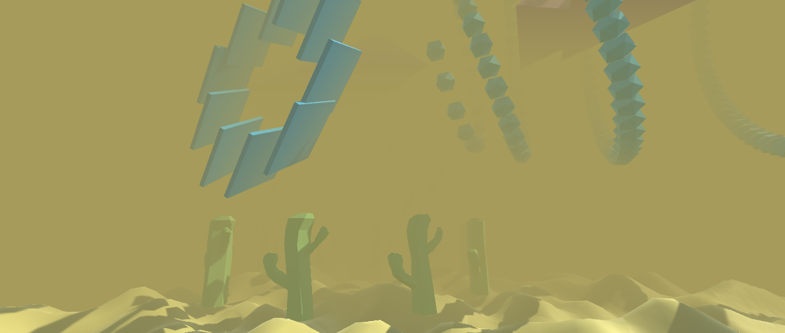
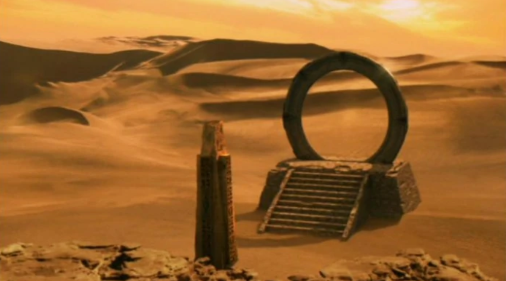
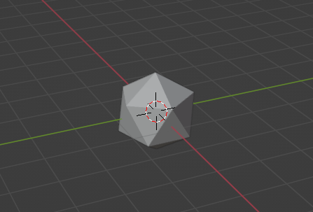

# Project Title

Name: Alexander Bowes
Student Number: C18727635
Course: Computer Science TU856
Module: Games Engines 1 2021/22

# Description of the project
This project is a system which demonstrates a number of procedurally generated elements. 
The project consists of a procedurally generated desert using perlin noise which can be navigated 
through using a first person camera.

If the player chooses to, they may move through the world and leave the starting area to continue
walking infinitely through the desert. As the player moves, new tiles of land will be procedurally generated ahead of
them, giving the impression of a never ending desert.

As well as the desert, there are game objects which have been 
instantiated in different patterns such as spirals and rings. When the player opens the project they
will see the camera is positioned in the center of a ring of cacti. The cacti game models were created
using Blender. 

As mentioned, other game objects have been instantiated in patterns, most notably the spiral of icospheres
which move in accordance to the song which plays when the project begins. 

Scripts have been written for icospheres, pyramids and flattened cubes to respond and move in accordance to the song which 
plays.

Color lerping has also been implemented which gradually changes the colors of the icospheres and flattened cubes over time.

Pyramids also respond to the audio and move through the spiral in response to the music.

I intend to have this project give the user an impression that they are seeing something which resembles
a science fiction movie with space ships and portals being discovered in a desert.










I think this project resembles something from the show Stargate:




# Instructions for use

The version of Unity which this project was created with was: 2020.3.19f1

The user can control the camera by moving the mouse in the dircention which they want to look at.
Moving the character:
- Press W key = Move forward
- Press S key = Move backward
- Press A key = strafe left
- Press D key = strafe right

# How it works

This project consists of key features:
- A Procedural, infinite desert
- Procedural spiral of icospheres
- Instantiated pyramids
- Ring of Cacti
- Color Lerping


The procedural desert was the first feature I set out to create. 
A single plane of land had to be created, this game object was called "Smart Plane" which was created
from a "plane" game object which means it holds the mesh of a Plane.

A smart plane had to be created with the perlin noise function, the reason for this is because 
Perlin noise allows for pseudo-random gradient noise and gradual transitions between peaks and troughs when creating
uneven terrain such as sand in a desert.  

This is shown in the start() function of "GenerateTerrain" which is responsible for creating 
an individual desert plane using perline noise:

```    void Start()
    {
        //get the plane mesh filter
        Mesh mesh = this.GetComponent<MeshFilter>().mesh;
        Vector3[] vertices = mesh.vertices;

        //for each vertex in the plane..
        for(int v = 0; v < vertices.Length; v++)
        {
            //assign the height of the vertex to be a value random value that allows for smooth transition when joining 2 planes
            vertices[v].y = Mathf.PerlinNoise((vertices[v].x + this.transform.position.x)/detailScale,
                     (vertices[v].z + this.transform.position.z)/detailScale)*heightScale;
        }

        mesh.vertices = vertices;
        mesh.RecalculateBounds();
        //update the normals after modifying the vertices
        mesh.RecalculateNormals();
        //allow for collision on the plane
        this.gameObject.AddComponent<MeshCollider>();
        
    }
```

After creating an individual desert plane, an empty object called "Landscape" was created. 
This object is responsible for instantiating new tiles for the player to walk along.

"Landscape" was given a new script component called "GenerateInfinite" which contains the code for 
generating new tiles.

In this script a Tile class is created which holds the GameObject of a tile (Smart Plane), the tile's creation time and a constructor for the tile.

In the GenerateInfinite class a hashtable is used to store key+values of tiles that are created. 
In the start() method, the initial tiles are created by instantiating tile objects
relative to the starting position in the world when the system begins:

```
 void Start()
    {
        this.gameObject.transform.position = Vector3.zero; //set position of tile to  0,0,0 of world

        startPos = Vector3.zero; // start position is also 0,0,0

        float updateTime = Time.realtimeSinceStartup; //time since game started

    
        //Generate initial tiles around the starting tile 
        for(int x = - halfTilesX; x < halfTilesX; x++)
        {
            for(int z = -halfTilesZ; z < halfTilesZ; z++)
            {
                //position vector that is relative to the starting position 
                Vector3 pos = new Vector3((x * planeSize+startPos.x),
                        0,(z * planeSize+startPos.z));

                //instantiate a plane at the position
                GameObject t = (GameObject) Instantiate(plane, pos, Quaternion.identity);

                string tilename = "Tile_" + ((int)(pos.x)).ToString() + "_" + ((int)(pos.z)).ToString();
                t.name = tilename;

                //new tile object is created and added to the hashtable with its name for keeping track of existing tiles
                Tile tile = new Tile(t, updateTime);
                tiles.Add(tilename, tile); 

                tilePositions.Add(t.transform.position);
                
            }
        }  
        SpawnObject(); //spawn cacti when the game starts
       
    }

 ```

The update() method of GenerateInfinite handles creating new tiles as the player moves through the 
world.
This gets the distance the player has moved from the starting position, checks has it exceeded the x or z size of a plane,
then generates a new tile if this is true:

```
	int xMove = (int)(cylinder.transform.position.x - startPos.x);
        int zMove = (int)(cylinder.transform.position.z - startPos.z);


        //if move further than the planeSize
        if(Mathf.Abs(xMove) >= planeSize || Mathf.Abs(zMove) >= planeSize)
        {
            //timestamp for new tiles created
            float updateTime = Time.realtimeSinceStartup;

            //retrieve integer value for x and z position and round off to nearest 10 (tilesize)
            int playerX = (int)(Mathf.Floor(cylinder.transform.position.x/planeSize)*planeSize);
            int playerZ = (int)(Mathf.Floor(cylinder.transform.position.z/planeSize)*planeSize);


 ```
The position vector of the new tile is created and then a check is done to see if the tile already exists in the hashtable.
If it does not exist, create the object, else update the creation time of the existing tiles:

``` 
 if(!tiles.ContainsKey(tilename))//if a tile has not already been created that has the same name.. (check if there is not already a tile on this spot)
                    {
                        GameObject t = (GameObject) Instantiate(plane, pos,
                                Quaternion.identity);
                                                                                    //create and add the new tile to hashtable
                        t.name = tilename;
                        Tile tile = new Tile(t, updateTime);
                        tiles.Add(tilename, tile);
                         
                    }
                    else
                    {
                        (tiles[tilename] as Tile).creationTime = updateTime;
                    }
   		//copy new hashtable contents to the working hashtable
            	tiles = newTerrain;
	//update start position
            startPos = cylinder.transform.position;

```

## First Person Player

A player prefab called "First Person Player" was created which held the cyclinder (representing the player model) and the camera which would show the viewpoint of the player.
In the prefab a script called "PlayerMovement" was written which holds an update() method that checks for
input such as the keys 'A' and 'D' being pressed for horizontal movement ranging from -1 to 1 and 'W' and 'S' for vertical movement ranging from -1 to 1.

After input is receieved, a vector3 called "move" holds the transform for the player object to move:

```
  public CharacterController controller;

    public float speed = 12f;

    // Update is called once per frame
    void Update()
    {
        float x = Input.GetAxis("Horizontal");
        float z = Input.GetAxis("Vertical");

        // Debug.Log("Getting horizontal input" + x);
        // Debug.Log("Getting Vert input" + z);

        Vector3 move = transform.right * x + transform.forward * z;
        
        controller.Move(move * speed * Time.deltaTime);
    }

```


For handling the player camera movement a script called "MouseLook" which is a component of the 
Main Camera object was written:

```
 void Update()
    {

        //get the value for movement ranging between -1 and 1 when moving along x and y with mouse
        float mouseX = Input.GetAxis("Mouse X") * mouseSensitivity * Time.deltaTime;
        float mouseY = Input.GetAxis("Mouse Y") * mouseSensitivity * Time.deltaTime;

    	xRotation -= mouseY;

        //limit the degrees which the camera can rotate along the x axis to prevent unpleasant camera angles
        xRotation = Mathf.Clamp(xRotation, -90f, 90f);

        transform.localRotation = Quaternion.Euler(xRotation, 0f, 0f);

        playerBody.Rotate(Vector3.up * mouseX);//move the player body in accordance to the camera change
    }


```


## Procedural spiral of icospheres

A proceducral spiral of shapes called icospheres are generated. 
The game object for an icosphere was created in Blender:



This was imported into unity as a game object called "icosphere" and it was assigned
a script component called "LerpColor" which would Gradually change the colour of the game object over time:

```
  // Start is called before the first frame update
    void Start()
    {
        iconMeshRenderer = GetComponent <MeshRenderer> (); //get the mesh renderer of the icosphere
        len = myColors.Length;
    }

    // Update is called once per frame
    void Update()
    {
        //set the colour of the icosphere's material to 
        iconMeshRenderer.material.color = Color.Lerp(iconMeshRenderer.material.color, myColors[colorIndex], lerpTime*Time.deltaTime);

        t = Mathf.Lerp(t, 1f, lerpTime*Time.deltaTime);
        if (t > .9f){
            t = 0f;
            colorIndex++;
            colorIndex = (colorIndex >= len) ? 0 : colorIndex;
        }
    }

```


An empty game object called "icoSpawner" was created which is used to generate the objects 
in a pattern.

The object has a component script called "GenerateIcons" which handles this functionality.

```

    for(int j = 0; j < loops; j ++)
        {
            //radius will be recalculated each loop as the spiral expands outwards
            int radius = startRadius + j;
            
            int num = (int)(Mathf.PI * 2.0f * j * startRadius);
            float theta = (2.0f * Mathf.PI) / (float) num;

            for(int i = 0; i < num; i++)
            {
                float angle = theta * i; //angle between the the previous and current sphere
                float x = Mathf.Sin(angle) * radius * 2.1f;
                float y = Mathf.Cos(angle) * radius * 2.1f;

                GameObject icon = GameObject.Instantiate<GameObject>(iconPrefab);
                Debug.Log("icon created" + icon);
                icon.transform.position = transform.TransformPoint(new Vector3(x,y,offset));
                icon.transform.parent = this.transform;
                offset = offset + .2f;
            }
        }

```

The icosphere object has a script component called LerpColor which gradually changes the colour
of the sphere's material over time

```

  void Update()
    {
        //lerping from the current colour of the material to the colour at myColour[colourIndex] over time
        iconMeshRenderer.material.color = Color.Lerp(iconMeshRenderer.material.color, myColors[colorIndex], lerpTime*Time.deltaTime);

        //assign value of t to be a value between t and 1f that changes over time
        t = Mathf.Lerp(t, 1f, lerpTime*Time.deltaTime);
        if (t > .9f){
            t = 0f;
            colorIndex++;
            colorIndex = (colorIndex >= len) ? 0 : colorIndex;
        }
    }


```


## instantiated pyramids
An object called "pyrmaid" was created from a Blender model. An empty object was then created called
"pyramidSpawner" which has a component script called "GeneratePyramids" which holds code for instantiating 
pyramid objects every 4 seconds.

```
 void Start()
    {
        //create a pyramid immediately
         GameObject pyramid = GameObject.Instantiate<GameObject>(pyramidPrefab);
    }

    // Update is called once per frame
    void Update()
    {
        //reduce the value of timer by 1 second every second
        timer -= 1 * Time.deltaTime;
        if(timer <= 0f) //if the timer hits 0 seconds, instantiate a pyramid
        {

            GameObject pyramid = GameObject.Instantiate<GameObject>(pyramidPrefab);
            //instantiate at the following position
            pyramid.transform.position = transform.TransformPoint(new Vector3((float)12,(float)15,(float)0));

            Debug.Log("Pyramid created at "+pyramid.transform.position.x+","+pyramid.transform.position.y+","+pyramid.transform.position.z);
            //reset timer
            timer = 4f;
        }
        
    }

```


## instantiated flattened cubes

Similar to the icospheres, a cube object is created called "ColorCube" which holds a component scriptcalled "CubeColorLerp" which 
holds the same functionality as the icosphere's "ColorLerp" script.
The ColorCube objects lerp through an array of colors over time:

``` 
  void Update()
    {
         //lerping from the current colour of the material to the colour at myColour[colourIndex] over time
        CubeMeshRenderer.material.color = Color.Lerp(CubeMeshRenderer.material.color, myColors[colorIndex], lerpTime*Time.deltaTime);

        
        //assign value of t to be a value between t and 1f that changes over time
        t = Mathf.Lerp(t, 1f, lerpTime*Time.deltaTime);
        if (t > .9f){
            t = 0f;
            colorIndex++;
            colorIndex = (colorIndex >= len) ? 0 : colorIndex;
        }
    }

```

An empty object called "CubeSpawner" is created which holds a component script called 
"GenerateCubes" instantates a ring of flattened cubes, similar to the ring of cacti:

```
 void Start()
    {
        int radius = 5;
        float offset = 0;

        //generating 10 cubes
        for(int i = 0; i < 10; i++)
        {

            //get angle between the 10 cubes
            float theta = (2.0f * Mathf.PI) / 10;
            float angle = theta * i;

            //get x and y positions of cube
            float x = Mathf.Sin(angle) * radius * 2.1f;
            float y = Mathf.Cos(angle) * radius * 2.1f;

            GameObject cube = GameObject.Instantiate<GameObject>(CubePrefab);

            //set position of the cube
            cube.transform.position = transform.TransformPoint(new Vector3(x,y,offset +10f));
           
            cube.transform.parent = this.transform;
            offset = offset + .2f;
        }
        
    }

```


## Audio listening 

The pyramid object has a component script called "AudioLoudnessTester" which
moves instantiated pyramid objects through the sky across the x axis.
The song "Western inside loop" is passed in as the audio source and
the loudness of the song is used to calculate the distance the pyramid moves:

```

 private void Awake()
    {
        clipSampleData = new float[sampleDataLength];
    }

    private void Update()
    {
        //handles the smoothness of the animation
        currentUpdateTime += Time.deltaTime; 
        if(currentUpdateTime >= updateStep)
        {
            currentUpdateTime = 0f;
            audioSource.clip.GetData(clipSampleData, audioSource.timeSamples); 
            
            clipLoudness = 0f;
            foreach (var sample in clipSampleData)
            {
                clipLoudness+= Mathf.Abs(sample);
            }

            clipLoudness/=sampleDataLength;

            clipLoudness *= sizeFactor; 
          
            //restrict the value of clipLoudness between the declared min and max sizes
            clipLoudness = Mathf.Clamp(clipLoudness, minSize, maxSize);

            Vector3 bounce = new Vector3(0, clipLoudness * 250,0); 

            pyramid.transform.Translate(bounce * Time.deltaTime); //Move the pyramids through the sky in accordance with the loudness of the song
            
        }
    }

```


# List of classes/assets in the project and whether made yourself or modified or if its from a source, please give the reference

| Class/asset | Source |
|-----------|-----------|
| GenerateTerrain.cs (Scripts folder) |  |
| GenerateInfinite.cs (Scripts folder) | |
| GenerateCubes.cs (Scripts folder) | |
| GenerateIcons.cs (Scripts folder) | |
| GeneratePyramids.cs (Scripts folder) | |
| AudioLoudnessTest.cs (Scripts folder) | |
| CubeAudioRotate.cs (Scripts folder) | |
| CubeColorLerp.cs (Scripts folder) | |
| IcoAudioSpin.cs (Scripts folder) | |
| LerpColor.cs (Scripts folder) | |
| MouseLook.cs (Scripts folder) | |
| PlayBackground.cs (Scripts folder) | |
| PlayerCollision.cs (Scripts folder) | |
| PlayerMovement.cs (Scripts folder) | Modified from  |
| rotateCactus.cs (Scripts folder) | Self written |


| MyClass1.cs | Modified from [reference]() |
| MyClass2.cs | From [reference]() |

# References

- Making an Infinite Terrain with Unity 5: https://www.youtube.com/watch?v=dycHQFEz8VI&t=7s
- Procedural Placement : Beginners Guide EP 3 - Unity3D: https://www.youtube.com/watch?v=vfl2HyEar68
- Spawning objects in a circle: https://answers.unity.com/questions/1661755/how-to-instantiate-objects-in-a-circle-formation-a.html
- Color Lerp in Unity, Best practice: https://www.youtube.com/watch?v=C_f2ChrcSSM
- How to make objects react to Music [Unity] | English: https://www.youtube.com/watch?v=LlkdQSjXd_A
- Instantiating objects in a circle (GE1 2021/22 Week 2 Lecture): https://tudublin-my.sharepoint.com/personal/bryan_duggan_tudublin_ie/_layouts/15/onedrive.aspx?id=%2Fpersonal%2Fbryan%5Fduggan%5Ftudublin%5Fie%2FDocuments%2FRecordings%2FGame%20Engines%201%2D20211001%5F135742%2DMeeting%20Recording%2Emp4&parent=%2Fpersonal%2Fbryan%5Fduggan%5Ftudublin%5Fie%2FDocuments%2FRecordings

# What I am most proud of in the assignment

I am most proud of creating the infinite terrain for this project as well as the blender assets such as the Cactus model.
I genuinely am happy with how the terrain turned out as I believe it does look like a desert when moving through it.

I am also proud of the spiral of icospheres that I generated procedurally as well as the elements that respond to sound
in an interesting way.

There were some things that I wanted to implement but could not ultimately complete due to time constraints.
- I initially wanted to have 3 different vehicle objects race in the desert and respond to the different terrain.
- I wanted to implement ai pathfinding but struggled to find a way to implement it.

Despite this, I am still quite happy with the outcome of this assignment as I learned much about Unity while working 
on it such as object instantiation, using audio sources, transfoms of objects, hashtables, color lerping and many other 
aspects of game development in Unity.

# Proposal submitted earlier can go here:

## This is how to markdown text:

This is *emphasis*

This is a bulleted list

- Item
- Item

This is a numbered list

1. Item
1. Item

This is a [hyperlink](http://bryanduggan.org)

# Headings
## Headings
#### Headings
##### Headings

This is code:

```Java
public void render()
{
	ui.noFill();
	ui.stroke(255);
	ui.rect(x, y, width, height);
	ui.textAlign(PApplet.CENTER, PApplet.CENTER);
	ui.text(text, x + width * 0.5f, y + height * 0.5f);
}
```


This is a youtube video:

[](https://www.youtube.com/watch?v=J2kHSSFA4NU)

This is a table:

| Heading 1 | Heading 2 |
|-----------|-----------|
|Some stuff | Some more stuff in this column |
|Some stuff | Some more stuff in this column |
|Some stuff | Some more stuff in this column |
|Some stuff | Some more stuff in this column |

